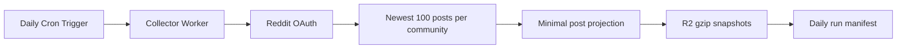

# Design

The collector deliberately uses the same forward-looking sampling rule for every community. Each run stores one deterministic object per subreddit at `snapshots/YYYY-MM-DD/<subreddit>.json.gz`; rerunning a date safely replaces that day’s object. A run manifest records successes and failures without presenting incomplete collection as complete.

The Worker uses the R2 binding directly, bounded Reddit responses, limited concurrency, explicit retries, structured logs, and no mutable request state. Deployment remains impossible until the owner creates the named bucket and adds Reddit OAuth secrets.
