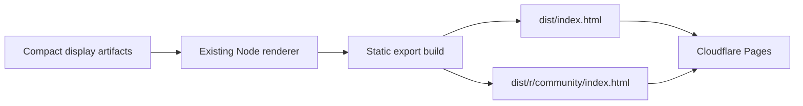

# Design

The checked-in compact artifacts remain the reproducible build input. A Node build script starts the existing renderer against those artifacts, requests every community view, rewrites only the community navigation target to a static route, and writes self-contained HTML.

The deployed output contains no raw JSON, compact JSON, embeddings, reports, or server process. Pages serves static assets from its edge cache.
