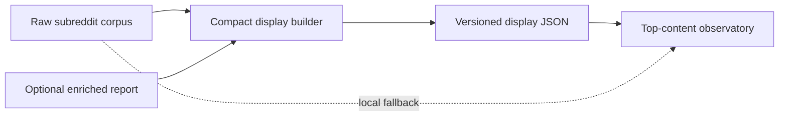

# Design

## Data flow

## Artifact contract

Each community artifact stores a schema version, generation timestamp, community, capability grade and rationale, source record counts, minimal post records, totals, top posts, and score histogram. Post records retain only fields consumed by the UI. Body text is bounded to prevent a small number of unusually long posts from dominating storage.

## Capability grades

- `strong`: at least 1,500 records and at least 500 records beyond the inferred newest-1,000 candidate pool.
- `limited`: at least 500 total records but insufficient older canon support for `strong`.
- `sparse`: fewer than 500 total records.

Grades describe available product material, not representativeness or confidence.

## Enrichment merge

When an enriched report exists, topic assignments are joined by Reddit post id or canonical permalink. The compact builder does not generate embeddings and does not infer topics for an un-enriched community.

## Safety

Generation is additive and deterministic. It never deletes or rewrites raw corpora. Each compact artifact is independently regenerated, and the directory index defines the current complete set.
