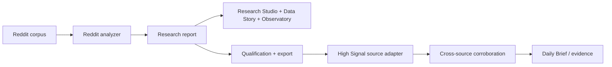

## Context

See `proposal.md`. The current generator loads one subreddit at process start,
emits fixed-width inline SVG, and writes a standalone HTML report. The analyzer
already supplies evolution phases, topic emergence, key shifts, period
comparisons, top posts, and optional comment-derived fields. The active corpus
work is owned by another agent and must remain untouched.

## Goals / Non-Goals

**Goals:**

- Make time and community the primary navigation dimensions.
- Keep generated HTML dependency-free, portable, and source-linked.
- Make chart geometry responsive without re-running analysis in the browser.
- Establish a compact High Signal observation boundary that is comment-ready.

**Non-Goals:**

- Cross-community statistical normalization in this iteration.
- Modifying ingestion, embeddings, topic anchors, or analyzer heuristics.
- Adding a High Signal adapter, D1 migration, deployment, or production config.
- Claiming historical completeness where Reddit coverage is sparse.

## Decisions

### Discover communities from collected datasets

The UI process scans raw `data/reddit-memory/<subreddit>.json` datasets and
loads the requested subreddit per HTTP request. When a full report exists it is
preferred; otherwise a lightweight historical view is derived from post
metadata at read time. This avoids a hard-coded catalog, exposes all collected
communities immediately, and keeps the UI aligned with the growing corpus.

Alternative: preload every report. Rejected because the corpus is growing and
startup memory should not scale with every community.

### Use a Living Research Studio information architecture

The first viewport contains a compact command strip, a large temporal topic
river, and exactly three prioritized findings. Three story chapters connect
claim, visualization, interpretation, and evidence. A Community Observatory
then exposes the broader topic-by-time record. Secondary raw tables remain
available through progressive disclosure rather than controlling the narrative.

The former archival serif/ledger system is rejected. The replacement uses a
dark spatial canvas, heavy sans-serif display type, stable saturated topic
colors, generous pacing, and one visualization-led focal point per chapter.

### Keep comments out of the active story

Stored comment bodies and reply-count metadata remain in the corpus and export
boundary, but the UI does not present comment findings in this iteration. The
post corpus is the honest common denominator across all 113 communities.

### Use intrinsic SVG plus bounded scroll fallback

Figures use `width: 100%`, explicit intrinsic `viewBox`, responsive text rules,
and chart-local scrolling only where the data density cannot be reduced safely.
The page grid collapses before cards exceed their container.

Alternative: add a chart dependency. Rejected to preserve the portable static
report and avoid a new production dependency.

### Treat time as a focus lens

All history remains the canonical longitudinal view. Shorter windows move into
an authored Focus menu with descriptions and a clear active state. A focus
change may still request the existing server-rendered report, but the UI uses a
cross-document transition where supported so the interaction feels like
changing a research lens rather than leaving the workspace.

### Add a post-only signal deck

The studio reuses report fields that do not depend on comment bodies: post tone
trajectory, score/upvote-ratio observations, and contributor post/score totals.
These live in a one-view-at-a-time signal deck below the observatory. This adds
analytical range through progressive disclosure instead of returning to an
equal-card dashboard.

The deck derives content signals from the analyzer's per-post title, score,
upvote-ratio, flair, topic, and timestamp records. Repetition uses normalized
title unigrams and bigrams with stop-word removal; emergence compares per-post
token prevalence in the earlier and later halves with a minimum-support guard;
topic and format performance show volume alongside median or average score and
approval so popularity is not confused with frequency.

The tone lens expands beyond positive/neutral/negative into curiosity,
frustration, urgency, uncertainty, excitement, and appreciation. These remain
transparent lexicon-based language markers, never claims about author emotion.

### Separate orientation from deeper findings

The first viewport keeps exactly three ranked findings. The next research act
must not restate them; it begins with the next supported findings in rank order.
This preserves immediate orientation while expanding the number of useful
observations without visual duplication.

### Make content signals temporal

Repeated and emerging phrases, assigned topics, flair labels, and platform
attention gain month-level series derived from distinct posts. Row-level
sparklines show prevalence rather than raw occurrence where community volume
varies sharply. A dedicated monthly-attention lens shows post volume, median
score, and average approval without forcing incompatible measures onto one
axis.

### Replace topic orbit with an attention map

The secondary observatory view maps each topic by total matched volume and
change in conversation share, with bubble size encoding represented-period
persistence. The axes are explicit and derived from the topic matrix; no
network, proximity, or causal relationship is implied.

### Export a separate observation envelope

The export artifact is generated beside each report and contains only qualified
observations, not the dashboard report. Version 1 has top-level source and
coverage metadata plus typed observations with evidence items whose `kind` is
`post` or `comment`. Optional comment evidence does not alter the envelope.

### Promote findings from deltas to evidence-backed research objects

Topic movements retain the early-versus-late conversation-share delta, but add
matched-post volume, represented-period persistence, peak period, recent
direction, and a conservative High / Medium / Low corpus-coverage grade.
The grade describes available corpus material, not confidence in the finding.

Per-post topic assignments retain canonical permalink and timestamp fields in
the report. The studio selects representative evidence from matching posts by
platform score and links directly to Reddit. Aggregate cluster text remains a
fallback only when canonical post evidence is unavailable.

### Replace longitudinal census language with a ranked-canon model

The stored corpus mixes a broad newest-post listing with bounded `top/year`
and `top/all` listings. It cannot support total historical activity or whole-
conversation prevalence. The studio therefore treats older records as a
**Historical Canon**: evidence about what Reddit ranked, rewarded, and kept
visible. The newest coherent cohort is a **Recent Candidate Pool** and is never
plotted as if it were comparable raw monthly volume.

Recent contenders are selected using age-aware relative performance within the
recent pool. Historical canon analysis uses within-corpus rank, persistence,
content format, and topic representation. A synthesis classifies topics as
durable winners, emerging contenders, fading canon, saturated now, or
undersupplied attention. Every result names its sampling lens and evidence
count. Months with sparse ranked evidence remain sparse rather than being
normalized into false completeness.

## Risks / Trade-offs

- Sparse early history can resemble a trend → show coverage beside every
  historical view and avoid claims based on under-sampled buckets.
- Topic anchors differ by subreddit → compare direction and timing before raw
  magnitude; defer normalized cross-community scoring.
- Large SVGs can still become dense → use direct label thinning and bounded
  figure scrolling with accessible tables.
- Export heuristics can overstate novelty → emit observations as candidates,
  include baselines and confidence, and require downstream corroboration.

## Migration Plan

Regenerate a known subreddit report with the updated UI, validate the static
artifact, then run the local server against several available subreddit reports.
Rollback is limited to restoring the UI generator; report JSON remains unchanged.
